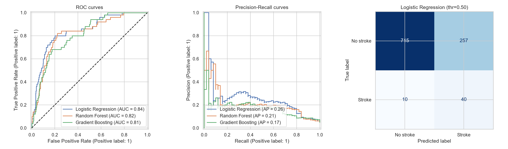
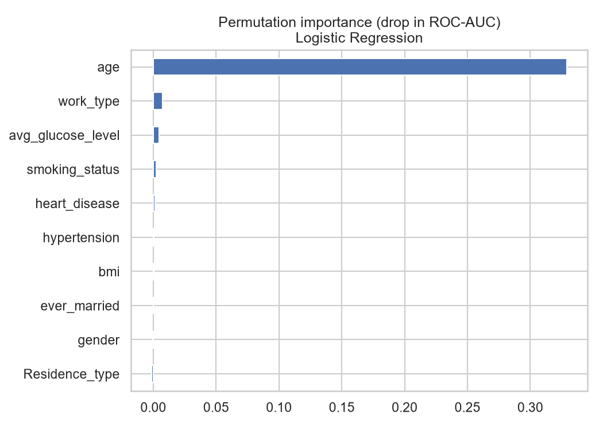

# 🧠 Stroke Prediction using Machine Learning

Predicting the likelihood of a patient having a stroke from demographic and health features
(age, Gender, hypertension, heart disease, glucose, BMI, smoking status, ...).

> Stroke is the second leading cause of death worldwide (WHO, ~11% of deaths). Early identification of
> high-risk individuals allows preventive care.

## Dataset
[Kaggle – Stroke Prediction Dataset](https://www.kaggle.com/datasets/fedesoriano/stroke-prediction-dataset)
· 5,110 patients · 11 features · target `stroke` (1 = stroke).

| Column | Description |
|---|---|
| gender, age | Demographics |
| hypertension, heart_disease | 0 / 1 |
| ever_married, work_type, Residence_type | Lifestyle / social |
| avg_glucose_level, bmi | Clinical measurements |
| smoking_status | formerly smoked / never smoked / smokes / Unknown |
| stroke | **Target** |

## Key challenges
1. **Severe class imbalance** – only 4.9% of patients (249 / 5,110) had a stroke. Accuracy is therefore misleading
   (predicting "no stroke" for everyone gives ~95%). We evaluate with **ROC-AUC, PR-AUC, recall and precision**.
2. **Missing values** – 201 missing `bmi` values → imputed with the median (inside the pipeline, so no data leakage).
3. One patient with gender `Other` was dropped (too rare to learn from).

## Approach
1. EDA (class balance, distributions, stroke rate per category, correlations)
2. Preprocessing pipeline: median imputation + scaling (numeric), one-hot encoding (categorical)
3. 80/20 stratified train/test split
4. Three models: Logistic Regression, Random Forest, Gradient Boosting – imbalance handled with **class weights**
5. **Decision threshold tuned** on out-of-fold train predictions (maximising F2, i.e. favouring recall, because
   missing a stroke is costlier than a false alarm) – the test set is never used for tuning
6. Evaluation + permutation feature importance

## EDA findings
- Stroke rate rises sharply with age: **0.4%** (≤40) → **4.1%** (40–60) → **13.6%** (60+). Median age of stroke patients is 71 vs 43.
- Hypertension: 13.3% vs 4.0% stroke rate. Heart disease: 17.0% vs 4.2%.
- Ever-married patients have a higher rate (6.6% vs 1.7%), largely because they are older (age confounding).
- Former smokers show the highest rate (7.9%).

## Results (held-out test set, 1,022 patients, 50 strokes)

| Model | Threshold | ROC-AUC | PR-AUC | Recall | Precision | F1 |
|---|---|---|---|---|---|---|
| **Logistic Regression** | 0.50 | **0.839** | 0.259 | 0.80 | 0.135 | 0.231 |
| Random Forest | 0.27 | 0.818 | 0.205 | 0.82 | 0.156 | 0.263 |
| Gradient Boosting | 0.58 | 0.808 | 0.170 | 0.58 | 0.168 | 0.260 |

The best model (Logistic Regression) catches **~80% of stroke cases**, at the cost of many false alarms
(precision ≈ 13%). **Age is by far the most important predictor**, followed by work type, glucose level and smoking status.




## Limitations & honest notes
- Low precision: this is a **screening-style** model that flags people for further checks, not a diagnostic tool.
- Only 249 positive cases → results have high variance; more data would help.
- `smoking_status = Unknown` (30%) and imputed BMI add noise.
- Not clinically validated; do not use for real medical decisions.

## Project structure
```
stroke-prediction/
├── data/healthcare-dataset-stroke-data.csv
├── src/
│   ├── train.py        # EDA + training + evaluation (run this)
│   └── predict.py      # score a single patient with the saved model
├── models/stroke_model.joblib
├── reports/
│   ├── figures/        # all generated charts
│   └── model_comparison.csv
├── requirements.txt
└── README.md
```

## How to run
```bash
git clone https://github.com/<your-username>/stroke-prediction.git
cd stroke-prediction
python -m venv venv && source venv/bin/activate      # Windows: venv\Scripts\activate
pip install -r requirements.txt
python src/train.py      # trains, evaluates, saves charts + model
python src/predict.py    # example prediction
```

## Future work
SMOTE / resampling comparison, hyperparameter tuning, SHAP explanations, calibration, Streamlit web app.

## Tech stack
Python · pandas · scikit-learn · matplotlib · seaborn
